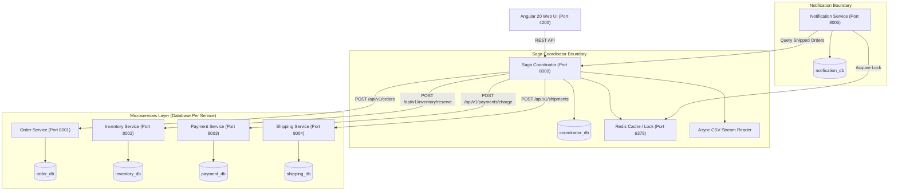
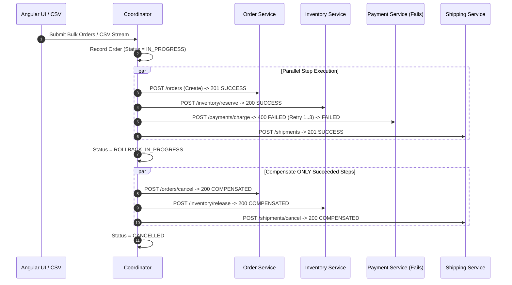
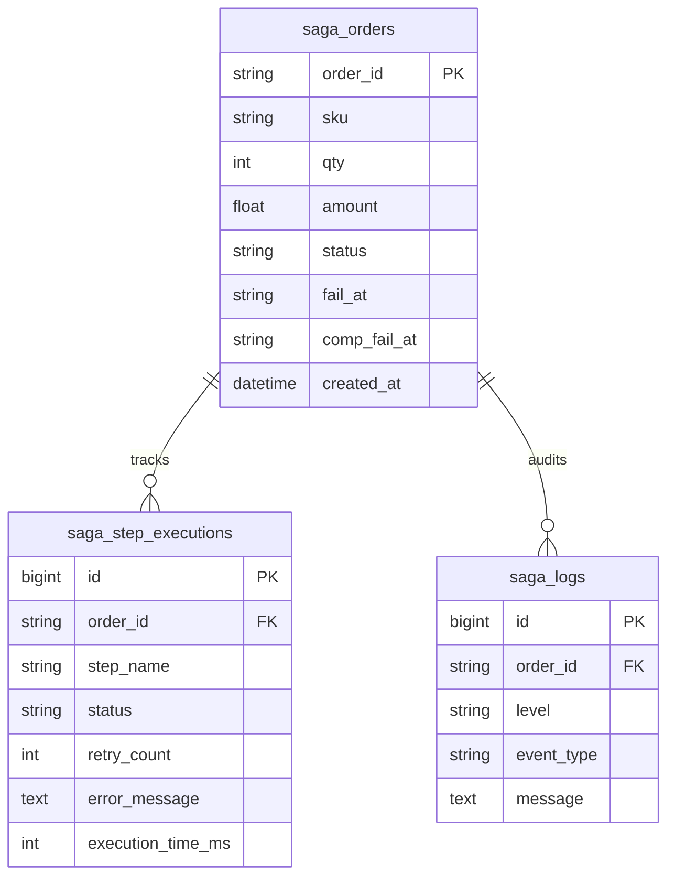

# Architecture & System Design Document

## 1. System Overview

The **Order Processing System** is a distributed, event-resilient microservice application designed to coordinate e-commerce order workflows at high concurrency using the **Saga Orchestration Pattern**.

---

## 2. High-Level Architecture Diagram

---

## 3. Sequence Diagram (Saga Parallel Execution & Rollback)

---

## 4. Entity Relationship Diagram (ER Diagram)

---

## 5. Idempotency & Fault Tolerance Guarantee

1. **Idempotency Key Injection**: Every request sent from the Coordinator includes `Idempotency-Key: {order_id}:{step}:{attempt}`.
2. **Double-Lock Caching**: Microservices check Redis cache first (`SET key val NX EX 86400`). If key exists, cached response is returned immediately.
3. **Database Pre-Persist**: Microservices write idempotency keys to their local MySQL tables to ensure deduplication survives Redis cache eviction.
4. **Needs Attention Trigger**: If compensating an order fails after retries, the Saga Coordinator marks the order `NEEDS_ATTENTION`, allowing operators to manually trigger undo recovery from Angular.
